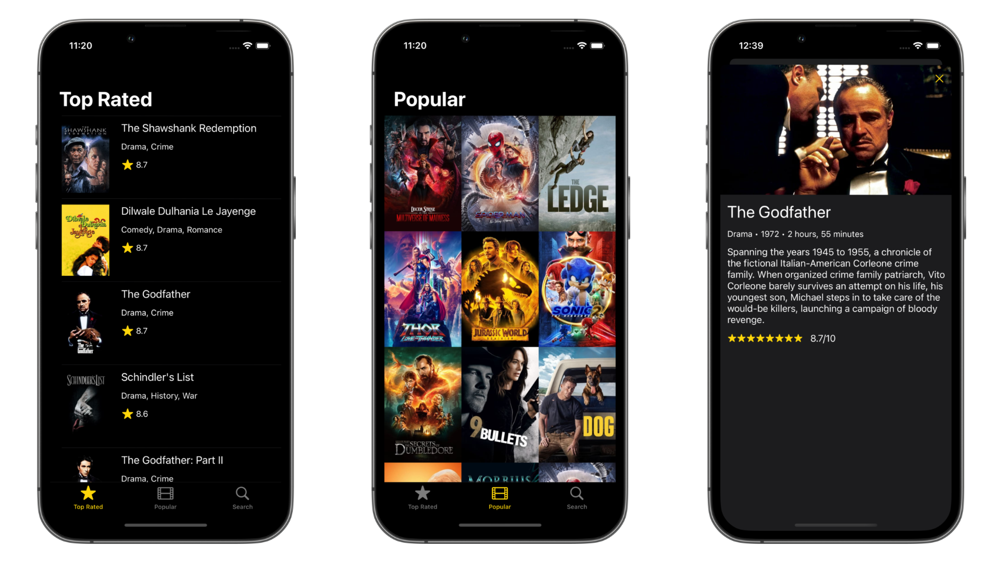
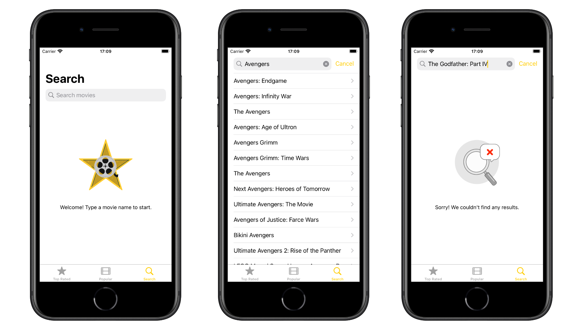

# CineMovie

<br>
<div style="display: grid; grid-template-columns: repeat(24, auto);align-items: center;">
<div>

</div>
<div>
<p>


CineMovie is an iOS app to list and show details of movies around the world.

You can navigate between Top Rated, Popular or Search movies.

All the information and data used in this project came from the [TMDB API](https://developers.themoviedb.org/3/getting-started/introduction).

</p>
</div>
</div>
<br>

## Features

- [x] List Top Rated & Popular movies 
- [x] Search movie by name
- [x] Movie details (genres, rating, overview, duration, year of release, etc.)
- [x] 100% programmatically UI (ViewCode)
- [x] Model-View-ViewModel-Coordinator pattern (MVVM-C)
- [x] CI/CD automated integration (build, test and lint)
- [x] Dark Mode
- [x] Pagination using Infinite Scroll
- [x] Error handling
- [x] Image caching

## Screenshots

#### iPhone 13 Pro


#### iPhone SE (2022)


## Technologies

- [Swift](https://www.swift.org)
- [UIKit](https://developer.apple.com/documentation/uikit)
- [GitHub Actions](https://github.com/features/actions)
- [SwiftLint](https://github.com/realm/SwiftLint)
- [Conventional Commits](https://www.conventionalcommits.org)
- [GitFlow](https://www.atlassian.com/br/git/tutorials/comparing-workflows/gitflow-workflow)
- [TMDB API Documentation](https://developers.themoviedb.org/3/getting-started/introduction)

## Instructions

1. Clone or download this repository.
2. This project uses SwifLint for enforcing Swift style and conventions, so you'll need to [install it](https://github.com/realm/SwiftLint#installation).
3. Open ```.xcodeproj``` file using [Xcode](https://apps.apple.com/br/app/xcode/id497799835?mt=12).
4. Open ```TMDB-Auth-Info.plist``` file in the target root directory.
5. On the ```TMDB_API_KEY``` value field, paste your own *(v4 auth)*  secret key generated by [TMDB API](https://developers.themoviedb.org/3/getting-started/introduction).
6. Hit ```Command (⌘) + R``` and enjoy.

## Coming Soon

- [ ] Localization Strings to support more regions and languages
- [ ] Create Upcoming and Now Playing menus
- [ ] Create cast, director, crew and trailers section
- [ ] Add new feature to show trailers from YouTube using [WKWebView](https://developer.apple.com/documentation/webkit/wkwebview)
- [ ] List and manage favorite movies using local storage
- [ ] Add snapshot tests to UI components
- [ ] Upgrade project to use Reactive Programming

## Contributing

If you have any improvement or feedback, feel free to open an issue or submit a pull request.

## Author

<b>Renan Consalter</b>
<br>
<span>
<small>iOS Engineer</small>
</span>

[](https://www.linkedin.com/in/renan-consalter)
[](https://www.instagram.com/renanconsalter)
[](mailto:renan.consalter@gmail.com)
